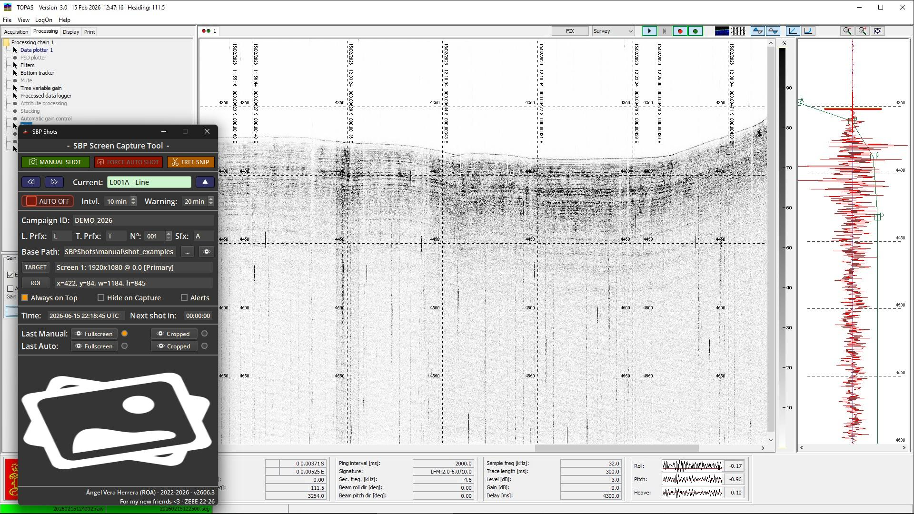

<div align="center">

# SBP Shots

**Screenshot automation tool for sub-bottom profiler monitoring during oceanographic surveys.**

[![C++20][cpp-shield]][cpp-url]
[![Qt 6][qt-shield]][qt-url]
[![Windows][windows-shield]][windows-url]
[![GPLv3 License][license-shield]][license-url]
[![Version][version-shield]][version-url]

</div>

---

## About The Project

SBP Shots is a lightweight Windows utility that takes structured, timestamped
screenshots of any sub-bottom profiler display (or any other window or
screen) while an oceanographic survey is under way.

During long acquisition lines the operator needs a consistent visual record of the profile
without babysitting the acquisition console. SBP Shots automates this: it captures the
configured region at a fixed interval, names every image deterministically, and files it
into a clean campaign tree organised by survey line and transit. Each capture is stored as
a **full frame** plus an **ROI crop**, so both the context and the area of interest are
preserved.

<div align="center">



</div>

The tool was developed by engineers from **Spanish Navy Observatory (ROA)** and has
been used operationally during survey campaigns.

> [!NOTE]
> A full walkthrough of every control is available in the
> [User Manual](SBPShots/manual/USER_MANUAL.md).

## Features

- **Automatic interval capture** with a configurable period and a live countdown.
- **Manual capture** on demand, with an optional per-shot comment.
- **Free Snip** mode to grab any arbitrary screen rectangle into a folder of your choice.
- **Region of Interest (ROI)** cropping: every capture yields a full frame and a crop.
- **Flexible target selection**: capture a full screen or a specific window through
  Windows Graphics Capture.
- **Campaign-aware naming and foldering** by line / transit section, with automatic
  `start` and `end` markers per section.
- **Capture watchdog**: optional alert when no capture has been saved for too long.
- **UTC timestamping** throughout, for unambiguous archiving.
- **Always-on-top** and **hide-on-capture** options so the tool never pollutes the image.

## Requirements

- Windows 10 version 1903 or newer (required for Windows Graphics Capture window capture).
- Qt 6 (developed against Qt 6.11.1, MSVC 2022 64-bit).
- Visual Studio 2022 / MSVC v143 (x64).
- Windows 10/11 SDK.
- CMake 3.24 or newer (Ninja recommended).

## Build

Open an *x64 Native Tools Command Prompt for VS 2022*, make sure the Qt MSVC `bin`
directory is on `PATH`, then configure and build with the provided presets:

```bat
cmake --preset msvc2022-release
cmake --build --preset msvc2022-release
```

Alternatively, open `SBPShots/CMakeLists.txt` directly in Qt Creator and build from
there.

Deployable binaries are produced under:

```
deploys/<triplet>/<version>/<release|debug>/
```

## Usage

1. Set the **Base Path** for all captures and a **Campaign ID**.
2. Choose the capture **TARGET** (screen or window) and draw the **ROI**.
3. Select the current section (line/transit, number, suffix) with the navigation arrows.
4. Set the automatic **Interval** and toggle **AUTO** on.

Captures are written as image pairs using the following layout:

```
<base>/<campaign>/<section>/<source>/<frame>/<campaign>_<section>_<source>_<frame>_<UTC>[_<marker>].JPG
```

- `source` is `manual` or `auto`; `frame` is `full` or `crop`.
- Example: `DEMO-2026/L001A/auto/crop/DEMO-2026_L001A_auto_crop_20260615_221909_761_start.JPG`

See the [User Manual](SBPShots/manual/USER_MANUAL.md) for the complete control reference
and example output.

> [!WARNING]
> If a captured **window** disappears while automatic capture is running, capture is
> stopped, the target falls back to the primary screen, and the ROI is cleared. The TARGET
> and ROI must be reconfigured before resuming.

## Versioning

Releases use a calendar-based `YYMM.build` scheme. The current release, **2606.3**,
corresponds to the third build of June 2026.

## License

Distributed under the GNU General Public License v3.0. See the [`LICENSE`](LICENSE) file
for more information.

## Author

**Ángel Vera Herrera** — Real Instituto y Observatorio de la Armada (ROA)
<avera@roa.es>

## Acknowledgments

- Spanish Navy Observatory (ROA)
- The [Qt Project](https://www.qt.io/)
- [Shields.io](https://shields.io)
- [Best-README-Template](https://github.com/othneildrew/Best-README-Template)

<!-- Badge definitions -->
[cpp-shield]: https://img.shields.io/badge/C++-20-black?style=for-the-badge&logo=cplusplus&colorB=555
[cpp-url]: https://en.cppreference.com/w/cpp/20
[qt-shield]: https://img.shields.io/badge/Qt-6-41CD52?style=for-the-badge&logo=qt&logoColor=white
[qt-url]: https://www.qt.io/
[windows-shield]: https://img.shields.io/badge/Windows-10%2F11-0078D6?style=for-the-badge&logo=windows&logoColor=white
[windows-url]: https://learn.microsoft.com/windows/
[license-shield]: https://img.shields.io/badge/License-GPLv3-blue.svg?style=for-the-badge
[license-url]: LICENSE
[version-shield]: https://img.shields.io/badge/Version-2606.3-orange.svg?style=for-the-badge
[version-url]: https://github.com/AngelVeraHerrera/SBPShots/releases