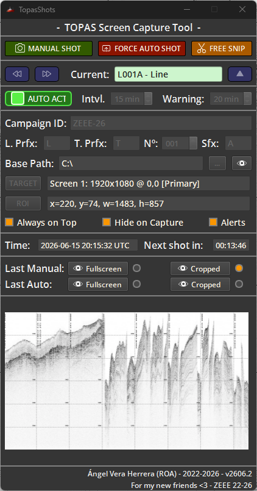
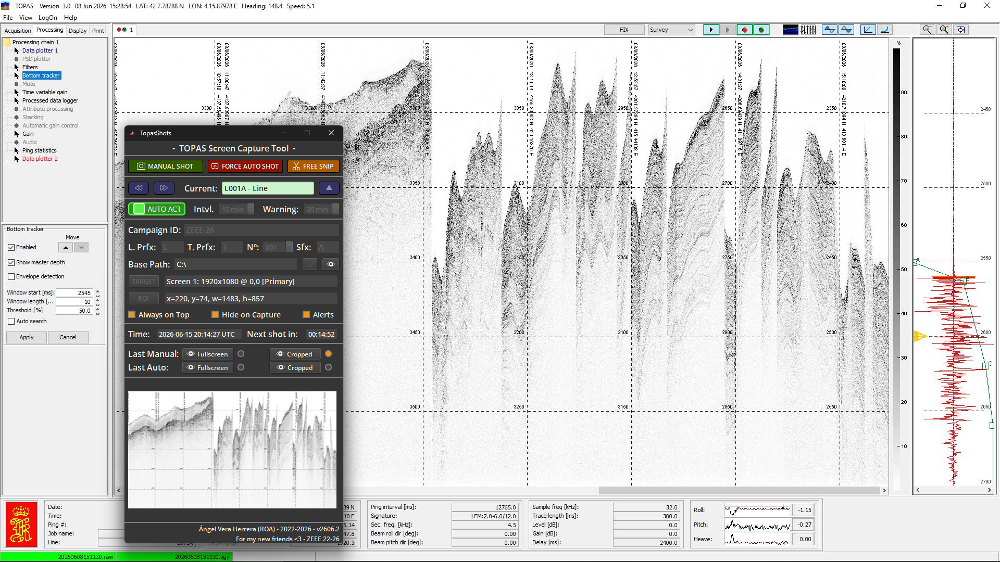
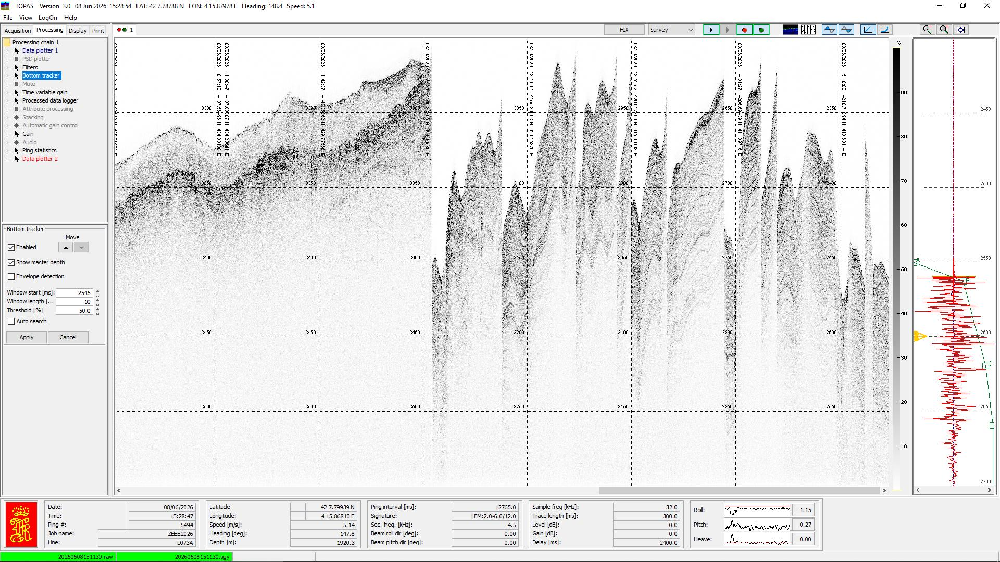

# TopasShots — User Manual

TopasShots is a small Windows utility that takes structured, timestamped screenshots of
the **TOPAS** sub-bottom profiler display (or any other window/screen) while an
oceanographic survey is running. It organises every capture into a clean campaign /
section / source / frame folder tree so the imagery can be archived and reviewed line by
line.

This manual covers the day-to-day operation of the tool. It is intentionally short: the
application is designed to be configured once at the start of a survey and then left
running.

---

## 1. The main window

TopasShots opens as a single always-resizable window. It can be kept on top of every
other application so it never gets lost behind the acquisition software.



In normal use it sits in a corner of the screen, on top of the TOPAS acquisition display
that it is capturing:



---

## 2. Quick start

1. Set the **Base Path** where all captures will be stored.
2. Fill in the **Campaign ID** (for example `ZEEE-26`).
3. Choose the capture **TARGET** (a screen or a window).
4. Define the **ROI** (the rectangular crop you want from each capture).
5. Set the current section with the navigation arrows (line/transit + number + suffix).
6. Set the automatic **Interval** (minutes between captures).
7. Toggle **AUTO** on. The first capture is taken after one full interval.

Once AUTO is active the tool keeps capturing on its own. You can still take manual
captures or force an immediate automatic capture at any time.

---

## 3. Controls reference

### Capture buttons (top row)

| Control | What it does |
|---|---|
| **MANUAL SHOT** | Takes one capture immediately and saves it under the current section as a `manual` shot. You are asked for an optional comment that is appended to the filename. |
| **FORCE AUTO SHOT** | Available only while AUTO is active. Takes an automatic capture now and restarts the interval countdown. |
| **FREE SNIP** | Lets you draw any rectangle on screen and save that single image to a folder of your choice. Independent of the campaign structure. |

### Section navigation

The **Current** field shows the active section, for example `L001A - Line`.
It is shown in green for survey **Lines** and in amber for **Transits**.

| Control | What it does |
|---|---|
| `<<` | Go to the previous section. |
| `>>` | Go to the next section. A campaign alternates transit → line → transit → line. |
| `^` (up arrow) | Bump the version **suffix** of the current section (A → B → C …) for a repeated pass. |

### Automatic capture

| Control | What it does |
|---|---|
| **AUTO** toggle | Enables/disables periodic automatic captures. Shows `AUTO OFF` or `AUTO ACTIVE`. While active, the campaign configuration fields are locked. |
| **Intvl.** | Minutes between automatic captures. |
| **Warning** | Watchdog time in minutes (see Alerts below). |

### Campaign and naming fields

| Field | Meaning |
|---|---|
| **Campaign ID** | Top-level folder name for the survey (e.g. `ZEEE-26`). |
| **L. Prfx** | Prefix used for survey-line sections (default `L`). |
| **T. Prfx** | Prefix used for transit sections (default `TL`). |
| **Nº** | Current line/transit number (zero-padded to three digits). |
| **Sfx** | Mandatory version suffix (A, B, C …). |

### Target and region

| Control | What it does |
|---|---|
| **Base Path** | Root folder for all captures. Use `...` to browse and the eye button to open the campaign folder. |
| **TARGET** | Selects what is captured: a full screen or a specific window. Windows are captured through Windows Graphics Capture. |
| **ROI** | Opens a selector to draw the rectangle that will be cropped from each capture. Shown as `x, y, w, h`. |

### Options

| Option | What it does |
|---|---|
| **Always on Top** | Keeps the TopasShots window above all others. |
| **Hide on Capture** | Hides the TopasShots window for a moment while the shot is taken, so it never appears in the image. |
| **Alerts** | When enabled, and AUTO is **off**, a warning pops up if no campaign capture has been saved for longer than the **Warning** time. This protects against forgetting to re-enable automatic capture. |

### Status and previews

| Element | Meaning |
|---|---|
| **Time** | Current UTC date and time. All filenames use UTC timestamps. |
| **Next shot in** | Countdown to the next automatic capture. |
| **Last Manual / Last Auto** | Show the last manual and automatic captures. Pick **Fullscreen** or **Cropped**, and use the eye button to open the image in a full viewer. |
| **Preview** | Live thumbnail of the selected last capture. |

---

## 4. How captures are stored

Every campaign capture produces **two images**: the full frame and the ROI crop. They are
saved under the base path using this structure:

```
<base>/<campaign>/<section>/<source>/<frame>/<filename>.JPG
```

- `source` is `manual` or `auto`.
- `frame` is `full` or `crop`.

The filename itself is:

```
<campaign>_<section>_<source>_<frame>_<UTCtimestamp>[_<marker>].JPG
```

Example (an automatic crop, first shot of the section):

```
ZEEE2026/L073A/auto/crop/ZEEE2026_L073A_auto_crop_20260608_152854_377_start.JPG
```

### Start and end markers

When automatic capture runs, TopasShots adds helpful markers automatically:

- The **first** automatic shot of an empty section is tagged `_start`.
- When you stop AUTO or change section, an `_end` shot is taken to close the section.

This makes it trivial to find the beginning and end of every line in the archive.

> [!WARNING]
> If the selected **window** target disappears while AUTO is running (for example the
> acquisition software is closed), automatic capture is stopped, the target falls back to
> the primary screen, and the ROI is cleared. You will need to reconfigure the TARGET and
> ROI before resuming.

---

## 5. Example output

A typical cropped capture of the TOPAS profile (ROI only):



A full set of example captures for one line is included under
[`shot_examples/`](shot_examples/).

---

## 6. Notes

- Configuration (base path, campaign, sequence, target, ROI, always-on-top) is saved
  automatically to `config.ini` next to the executable.
- All timestamps are in **UTC**.
- Free Snip captures are saved wherever you choose and are not part of the campaign tree.
